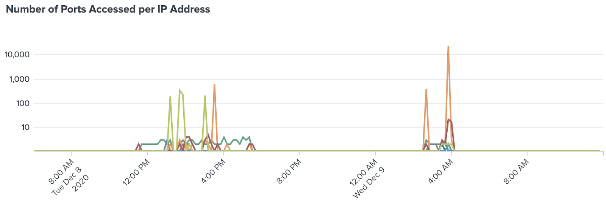
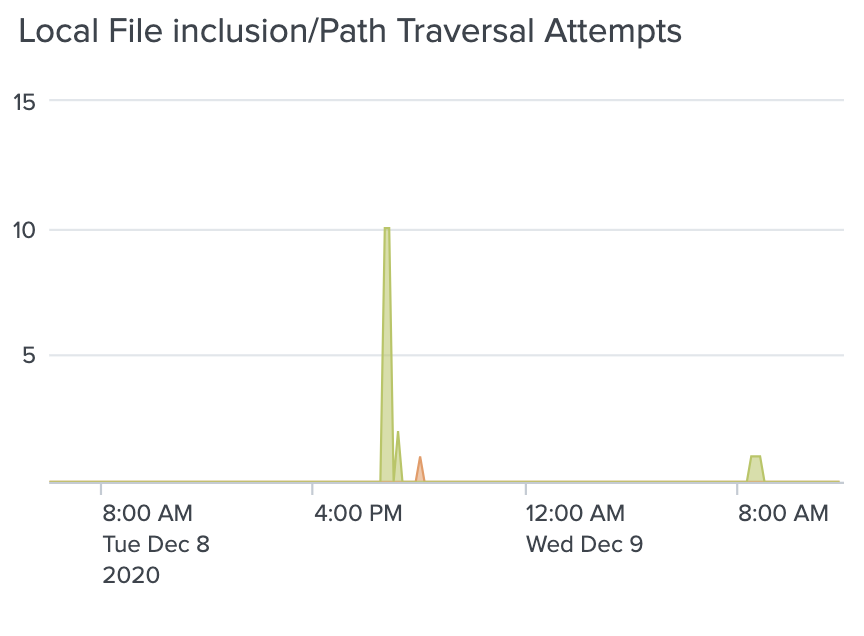

# Project Overwatch

Andrew Jerry & George Mathai | December 2020 | Caltech CTME Cybersecurity Bootcamp powered by Fullstack Academy

[TOC]

# Overview

Project Overwatch is a wrapper for the Splunk platform that allows an analyst to visualize information gathered from logs, and be able to identify suspicious activity quickly. With a few simple dashboards, an analyst can monitor traffic from multiple machines concurrently, and be able to identify threat actors using visualized detections.

## Background

By some estimates SOC engineers encounter on average 10,000 alerts per day. While teams in larger organizations can see in excess of 1,000,000 alerts a day. These astronomical numbers leave an insurmountable backlog of network incidents that can lead to analysis paralysis. A number of similar points are raised by data managements specialists Enterprise Management Associates, (EMA), as well as other data specialist firms :

- Only 17% of organizations have a dedicated threat hunting team. — Fidelis Cybersecurity, 2018
- “79% of security teams” feel “overwhelmed by the volume of threat alerts.” — EMA
- 60% of Security Operations Center analysts can only handle between 7-8 incident investigations per day. — Fidelis Cybersecurity, 2018
- “on average, analysts were spending 24 and 30 minutes to investigate each incident they received.” Much of this time is spent downgrading alerts incorrectly marked as critical (46%), mis-prioritized (52%) or determined to be a false positive (31%).”— EMA
- Culminating with, “analysts waste over half of their day looking for problems that are either insignificant or not really problems at all.”

And these concerns are only increasing as more and more people get connected through a plethora of data producing devices both on wired and wireless networks. The bulk of this data, almost 90%, involves machine data. Examples include automation event logs & reports, data-producing algorithms and AI calculations not to mention all of it’s subsequent meta-data. Sifting through this massive amount of data highlights the importance of data-mining tools like Splunk. But even with the power of Splunk, security professionals need to streamline their efforts in order to hone-in on and ferret out the land mines hidden in the dizzying volumes of information. The threats can easily compromise the CIA triad of cybersecurity. These three tenets are confidentiality, integrity and availability. Failures in any one could lead to data loss, breached devices and untold damages to an organization.  

The threats buried in the hundreds of logs and reports can be numerous and varied. What is important could depend on a company’s business plan or an organization's purpose. For example an e-commerce website could have SQLi attacks near the top of their radar since many of these attacks focus on databases that hold vast amounts of products and the data associated with them, can be called up in the form of tables. The injected software commands can look to manipulate these tables but in reality the hidden intent is to give up sensitive customer files or payment records.

Another organization could focus on malicious code in the form of ransomware. A school, for example, would want to protect it’s personnel data. For an attacker the prize here is the student records and teacher personnel data. In the execution, a potential threat vector, among several, could be a file inclusion attack. As a preventative, malware buried in machine data could be mined for traces of a file inclusion command invoked through insecure websites and servers. These attacks can happen locally on the system or enacted remotely and are also referred to as LFI and RFI, respectively. For clarity, the anatomy of such an attack is as follows:


If successful, a whole school school district can have its entire computer systems locked-up encrypted and held out for a big payday. Besides these two potential cases, there exists a number of different cyber attacks whose seeds are sown in machine data. While Splunk can sift through this data, the SOC team has to efficiently customize the different ways of getting at it with another eye on the logjam of alerts still pending. Here’s where our visualizer can help in stemming the tide of notifications and give the security a fighting chance to keep their machines secure. By prioritizing their most important threats, SOC analysts can include what they want to quickly see by picking from an updated library of attacks and threat vectors. These can be implemented and customized on our one-stop visualization tool. For the purpose of this beta, we have demonstrated its effectiveness with several types of attacks delineated later in this post.

## Goals for Project Overwatch

Provide a succinct visual representation of mission-critical SOC alert data.  

In conjunction, we seek to increase the productivity of security professionals by helping to quickly address the most important network issues arising from mountains of Splunk data.  

## Why Visualization is Important 

The old adage says “a picture is worth a thousand words”. A version for today could be that a jpg is worth thousands of pixels. Furthermore, a pixel by itself is in a sea of millions of free floating bits. Nonetheless, it is still only a bit of information. On its own, it’s meaning is very limited. But when ordered and organized, the collection can convey a very different and more powerful picture relevant to an actionable result. Actions that can keep a network secure or even harden it to further attack. A single pane of glass, as we are proposing, coalesces the myriad of Splunk event data. With the big picture in hand and paneled with a handful of discrete images of the threats, we can give our analysts a fighting chance to deploy actionable measures and achieve their security objectives. 

## What are other people doing in the industry?

A cursory look into other tools in the marketplace points to many products incorporating Splunk data. Other companies without Splunk, have developed their own network traffic and machine data mining capabilities. Many companies work with Splunk because it’s the market leader in analyzing machine data. By leveraging this pedigreed data mining solution, specifically for cybersecurity purposes, they bring business intelligence and security to their enterprises. The following is by no means a comprehensive list of companies and tools in network security but a light sampling of the various organization sizes and capabilities in the cybersecurity space:

[Palo Alto Networks](https://www.paloaltonetworks.com/) is the global cybersecurity leader, who claims to be continually delivering innovation to enable secure digital transformation—even as the pace of change is accelerating. Palo Alto Networks and Splunk have partnered to deliver an advanced security reporting and analysis tool. The collaboration provides operational reporting as well as simplified and configurable dashboard views across Palo Alto Networks family of next-generation firewalls. The specific offering is still not known but they do have Splunk visualizations dashboards.

[Fidelis CyberSecurity](https://fidelissecurity.com/) - A medium sized player, offering enterprise level cybersecurity with their own platform and products. They determine a client's cyber terrain map of legacy systems, shadow IT and enterprise IoT devices. And analyzes all incoming, internal, outgoing, and cloud traffic with high-throughput devices.  This leaves them with their own data mining efforts independent of Splunk.

[Fabrix Inc](http://www.getfabrix.com/product/fabrix) - A smaller company that centers it’s efforts in the visualization of data. And in particular to organizing and analyzing operational data for operational intelligence. Their goal is to primarily to make a centralized solution for effective communication when operational issues arise in different areas of the business. This enables it’s teams to identify, resolve, remediate and act fast when problems and disruptions occur.  Although their offerings are connected to the Splunk platform there is no clear utilization of cybersecurity data as a robust defense against outside cyber threats. 

[Booker DiMaio ](https://bookerdimaio.com/about-us/) - offers a comprehensive suite of end-to-end big data solutions. They have a division for cybersecurity with Splunk as a partner but it’s not clear how their offerings are deployable on a wide scale basis but rather individual projects solving niche needs. The firm appears to be a much smaller organization that has more of a big data focus than a cybersecurity threat prevention & remediation model.  

## Most Common Attacks Today

In order to make sure that the end product is useful in a majority of cybersecurity situations, we targeted some of the top attacks that are seen in the world today. While working with limited time and resources, this project’s scope was limited to defending Linux based web servers. This allowed this first revision of Overwatch to be tuned to detect many attacks in this specific environment.

These are the top 5 attacks against web servers as identified by [MSSP Alert](https://www.msspalert.com/cybersecurity-breaches-and-attacks/5-most-common-web-application-attacks/):

1. XSS - Cross Site Scripting
2. SQL Injection
3. Path Traversal
4. Local File Inclusion
5. DDoS - Distributed Denial of Service

As a team, George and Andrew discussed the commonplace attacks we know red-team professionals use that we wanted to be able to detect:

- Nmap port scanning & enumeration
- Dirbuster Scanning for web directory enumeration
- Brute-force login scripts for various protocols such as SSH

This instance of Project Overwatch was targeted to encapsulate these mentioned attacks, and our efforts employed on creating a single dataset that could be used to detect all of the attacks within one static time window.

## What is Project Overwatch?

Three dynamically linked dashboards allow an analyst to quickly identify threats. The simplicity of Overwatch allows a user to intuitively navigate through these pages to gather information on threat actors.

The main *Overwatch* page will correlate data for all web server data within an index. Across the four charts are detections for high network activity, port scans, SSH login attempts, and directory enumeration. Each colorset represents events for a different web server. By clicking on any data point on these graphs, a user will be taken to the dashboard specific to that web server.


The *Overwatch: Web Server* dashboard has more detailed information separated by color for each client IP address. In addition to the detections from the main dashboard, this dashboard is set up to detect local file inclusion, cross-site scripting, and SQL injection. Clicking on any data point in these charts will bring the user to a panel of information specific to that IP address.


On the final chart, the *Overwatch: IP Address* dashboard, the user is presented with information for a specific IP address. Some of the specific information we can see is user-agents in use as well as usernames attempted in SSH logins. The user can also see the different interactions this IP address had with every web server in the network over time. This can help put together a story about when certain actions were taken by the attacker, which machines were compromised, and in what order.


These three simple dashboards, provided as XML templates, allow anyone to quickly monitor their networks and detect malicious activity, The templates can be modified to suit specific environments and applications.

# Creating Project Overwatch

The main subject of interest of this project is how we analyze data as cybersecurity analysts to detect threat actors and their attacks. Although the goal of Project Overwatch was to build Splunk search queries and transform them into useful visualizations, testing and tuning these tools required extensive effort in generating a useful dataset. We learned the journey to creating a useful dataset that satisfies the criteria demanded by this project was filled with obstacles and roadblocks, and reporting and cataloging that data into a complex enterprise software such as Splunk required intense planning, logical methodology, and a lot of technical skills for the operating systems and software that you are defending.

## How to create a useful dataset

In machine learning, the training data that you feed an algorithm is critically important to the success of that algorithm on a real-world data set. We treated our search for security anomalies in network traffic with a similar frame of mind. In order to have tools that can accurately detect malicious activity in real-time, we need to provide a dataset that models what a real attack looks like. To keep our data generation process within the scope of our timeline and resources, we chose to focus on what defensive visualizations could be made for an analyst concerned with a set of web servers on a network. While working on a proof of concept for Project Overwatch, the data set was generated with a single attacker and web server. This allowed for some basic graphs with obvious spikes but it didn’t show how much an attack would stick out within an enterprise network. 

In an attempt to maximize the resources available, we attempted to create a better dataset. Although results were semi-successful, there was more data to look at which meant improvements. The new dataset was an attempt to network five virtual machines together on a subnet: four vulnerable machines hosting Apache web servers, and one instance of Kali Linux 2020 running a bash script to initiate all of the network traffic. The shell script attempted to create several virtual network interfaces and use five of them to generate regular user traffic and three to run the malicious attacks we wanted in the dataset.

Although some command line tools in linux allow you to specify an interface to send traffic out on (curl and nmap for example), some of the tools we wanted to use (hydra and dirb) were limited in that capability and that traffic was only generated from a single address on the Kali Linux machine.

The web server machines used included [OWASP Broken Web Applications](https://sourceforge.net/projects/owaspbwa/), [LazySysAdmin](https://www.vulnhub.com/entry/lazysysadmin-1,205/), [Zico’s Shop](https://www.vulnhub.com/entry/zico2-1,210/), and [Metasploitable](https://sourceforge.net/projects/metasploitable/). Using previous knowledge of the vulnerabilities of these machines, it was a fairly simple task to exploit the web vulnerabilities using a variety of tools and capturing the results in Burp Suite, a web proxy. From Burp Suite the malicious requests could be copied to the data generation bash script in the form of curl requests, and the [--interface] flag was added with the appropriate virtual network interface. Requests categorized as regular user traffic were also generated this way.

In addition to web traffic, nmap (port enumeration), dirb (directory enumeration), and hydra (brute-force SSH/HTTP) were used to create additional traffic to be detected.

### Synchronizing Log Timestamps 

When importing data and looking for correlations between machines, it is essential to have every computer’s clock in sync as they log information with timestamps. While preparing to create the dataset for this project, there was a lot of difficulty getting the machine clocks, hardware clocks, system time zones, apache time zones, and splunk time zones synchronized. Before embarking on a similar journey, be sure to understand all the clocks that must be configured and when possible: use an NTP server.

### Configuring UFW Auditing

The uncomplicated firewall (UFW) is a free firewall program that can be quite beneficial for logging network traffic. Even when completely unrestrictive, the firewall’s logging mode can be set to high, allowing all traffic to be audited. This is how Overwatch is able to detect network based attacks like port scanning.

### Linux Logs that are useful for security

- `/var/log/auth.log` - Records all authorization attempts to the system including SSH and Sudo
- `/var/log/syslog `- UFW network traffic audits are recorded in this log
- `/var/log/apache2/access.log` - Records all HTTP request and response metadata for Apache web servers

## Importing Logs into Splunk

1. Upload each log file in your dataset to your Splunk instance, according to the Splunk [documentation](https://docs.splunk.com/Documentation/SplunkCloud/8.1.2011/Data/Uploaddata).
2. Select the correct source type for each log according to the [documentation](https://docs.splunk.com/Documentation/SplunkCloud/8.1.2011/Data/Setsourcetype). We used the following sourcetypes for our data:
   - `/var/log/auth.log` -- `linux_secure`
   - `var/log/syslog` -- `syslog`
   - `/var/log/apache2/access.log` -- `access_combined`
3. Edit the *host field value* to be the hostname of the web server and select the appropriate index. It is important to use the actual hostname of each web server as this data needs to correlate with the hostname in the syslog files.
4. Create a search query for each sourcetype
   - .e.g. ` *index="proof_of_concept" host=”hostname” sourcetype="access_combined"* `
5. Verify that the essential fields are extracted from these sources. These fields are used by the search queries used in Project Overwatch, and are necessary for generating useful visualizations.These fields are needed for the Overwatch Dashboards:
   - `access_combined` - clientip, uri, status (HTTP Response), method (HTTP request method), useragent
   - `linux_secure` - clientip, process (e.g. *sshd[8341]*), status (e.g. *Failed password*), username
   - `syslog` - ID, SRC, DST, SPT, DPT
   - Some of these fields will be automatically parsed by Splunk for you. For any of these fields missing from your Splunk instance, follow the [documentation](https://docs.splunk.com/Documentation/Splunk/8.1.0/Knowledge/ExtractfieldsinteractivelywithIFX) for using the Field Extractor using the regular expression method to get the essential fields. Make sure to set Field Extractions as available to all apps or global permissions.

## Creating a Dashboard

The goal of this project is to visualize all activity for a webserver using a single “pane of glass,” or grouping all visualized Splunk searches into a single dashboard. Dashboards are a utility in Splunk that can contain many search queries as different charts for quick reference. Dashboards are stored as XML data which can be edited directly, or the built in graphical editor can be used. Project Overwatch includes three separate dynamic dashboards: *Overwatch*, *Overwatch: Web Server*, and *Overwatch: IP Address*. For this walkthrough of building a dashboard, *Overwatch: Web Server* will be demonstrated as it is the most feature-filled.

### Selecting Time, Index, and Host

When creating a dashboard that is flexible for a variety of analysis situations, it is important to keep all functions as dynamic as possible. The Project Overwatch dashboards all contain a set of dropdown menus, including the time range selector. A fixed time range was used for this example dataset, but a real-time analysis environment would benefit more from this feature. 

#### Splunk Input Options

Splunk dashboards provide support for a variety of user input options including text, dropdown, checkbox, multiselect, and more. This project focused on the dropdown menu, as it was fairly simple to integrate into the final solution. There may be opportunities for other input methods in future expansions of Project Overwatch.

#### Splunk Tokens

Anyone with coding experience will find the concept of variables familiar. Splunk uses a concept called tokens to save values between searches and get user input into panels. Anytime a user wants to use a token in place of a fixed value, the syntax *$token$* is required. 

At the top of *Overwatch: Web Server* are four dropdown menus for user input.


The first of these is the time range used for all searches on the page. When in edit mode, select the time option under the *Add Input* dropdown. Give the input a label and a distinct token name and save your work. When selecting a time range on each search panel, specify the time token instead of a static range.

To create a dynamic index dropdown menu, create a new dropdown with a label and token name. The token used in this walkthrough is `index_tok`. Under *dynamic options*, insert the following query in the search box:

```
index=* sourcetype=* | table index | dedup index
```

In the *field for label* & *field for value*, enter *index*. This will parse all log information and extract all available indexes. *dataset02* is the only index used in this walkthrough. All data from the four web servers is in this index.

To create a dynamic web server dropdown menu, follow the same steps with a token value of `host_tok` and the following search query:

```
index="$index_tok$" | table host | dedup host
```

Enter `host` in the same label & value fields.

The time resolution panel functionality will become more apparent after we have a chart on the dashboard. For now, add a new dropdown menu with a token value *res* the following label/value pairs as static values: 5 minutes/5m, 10 minutes/10m, 15 minutes/15m. More values can be added later as different resolutions may be needed for some situations.

## Looking for spikes in Network Traffic

A spike in network traffic from a single IP address relative to a baseline traffic pattern is a good indicator of malicious traffic on a network. While this indicator may not provide much insight as to what kind of attack may be taking place, it does have the benefit of catching some attacks that are not detected by more hyper-specific indicators of compromise. 


All charts in splunk start with a search query, and narrowing your search to the minimum information possible will create the best results. For this line chart, the syslog file has the most useful information because it is where UFW logs all of its data to. There is a lot of other data in syslog that we don’t want, so we can use `SRC=*` in our query to make sure we only return logs that have a source IP address. UFW sometimes will have multiple entries for a single network session, but gives each session a unique ID. Splunk’s *dedup* command will remove any duplicate entries for us. We want to be able to identify the IP addresses with the most traffic, so we have to tell Splunk to sort the data by number of network sessions over time per IP address. The final search query for this chart:

```
index="$index_tok$" host="$host_tok$" sourcetype="syslog" SRC=*
| dedup ID*
| timechart span="$res$" count by SRC where max in top10 useother=f
```

Using tokens for index and host allow this chart to pull the information from the dropdowns we made earlier. The timechart command has a few other options that proved useful in practice including limiting the display to the top 10 IP addresses so as to not clutter the screen with data.

In the example above, several spikes from two distinct IP addresses (colors) are shown. These charts show the value of the IP address when moused over. This is a strong indicator that there are two threat actors attacking the web server in this example. The rest of the traffic has a fairly consistent pattern that the suspected IP addresses do not fall into.

With a more sophisticated host firewall configuration, it may be beneficial to have separate panels for blocked, allowed, and audited traffic. This dataset used UFW to exclusively log network sessions to and from each web server, not to block it. 

The use of the logarithmic scale for the y-axis instead of a linear one is discussed later under *Tuning the Dashboard & Analysis of Results.*

## Detecting Port Scan Enumeration

In order to detect a port scan enumeration used in active reconnaissance by red team professionals and hackers, we must first identify its unique characteristic to search for. Using a tool like nmap, a client will generate traffic to many ports on a server to discover vulnerabilities. 



The data used for this is similar to the network traffic analysis. The UFW data in the syslog also tracks source & destination ports which is perfect for this detection. 

The final search query:

```
index="$index_tok$" host="$host_tok$" sourcetype="syslog" OR SRC=*
| dedup ID
| timechart span="$res$" dc(DPT) by SRC where max in top10 useother=f
```

The new function used here is *dc*, or distinct count, which counts every unique instance of each *DPT* value. So if an IP address has a dozen interactions with port 80 within a second that will only count as one port accessed at that point in time. However an active port scan interacting with hundreds if not thousands of ports in a short period of time will result in spikes on the graph, as seen in the above example.

## Detecting an SSH Brute Force Attack

To detect brute force attacks, we need to monitor traffic similarly to the previous examples and narrow our scope further. In the case of SSH on port 22, the Linux operating system tracks all login attempts whether accepted or failed in *auth.log*. 


The search query for these charts:

```
index="$index_tok$" host="$host_tok$" process=ssh* clientip=* [status=fail*] 
| timechart span="$res$" count by clientip where max in top10 useother=f
```

The *[status=fail\*]* argument is the only difference between these two charts, adding it narrows the scope of the search to only failed SSH login attempts. Either of these methods may be preferred based on the real-world situation. The process argument is necessary because *auth.log* contains more information than we are looking for. That other information may be useful for detecting other kinds of attacks in future revisions. 

For this dataset only one IP address was used to attack this web server. The accepted SSH logins that appear in the chart on the left are from legitimate communications with the web server during the process of preparing to create the dataset. Even though the chart on the right draws a clearer picture about when an attack is taking place, the normal attempts adding to the noise of the chart on the left do not conceal the anomalous activity.

Although spike in network activity (logged by the host firewall) on port 22 would be a suggestive indicator of malicious activity, it could also be a misleading representation of normal SSH traffic that may be used in an organization. Using the auth.log data provides more detailed information to be used at the analyst’s discretion including whether the attempts succeeded or failed and the user account used that was logged into.

## Detecting Directory Enumeration

One of popular techniques used by red team professionals and hackers conducting reconnaissance on a web server is directory enumeration. Popular tools such as dirb, dirbuster, and gobuster allow the end user to send HTTP requests based on a wordlist of popular web directory names and gather information based on the web server’s responses to each request. Because of the length of these wordlists, in most cases a tool like this will cause a web server to generate a lot of 404 responses in a short period of time. There will also be a few 403 & 50* responses in some configurations. Apache web servers keep track of the response code generated for each request in *access.log*.


The search query used for this chart:

```
index="$index_tok$" host="$host_tok$" sourcetype="access_combined" (status="4*" OR status="5*") 
| timechart span="$res$" count by clientip where max in top10 useother=f
```


## Detecting Local File Inclusion 

Some of the common LFI attacks that we tried to defend against are explained in [this article](https://highon.coffee/blog/lfi-cheat-sheet/). By searching for some of the common patterns noted in the article, we can detect local file inclusion and path traversal attempts.



The search query used for this chart:

```
index="$index_tok$" host="$host_tok$" (uri="*../*" OR uri="*except://*" OR uri="*php://" OR uri="*proc/self*" OR uri="*/etc/*") 
| timechart span="$res$" count by clientip
```


## Detecting XSS and SQL Injection Attacks

> *“The reason there are two different ways to detect SQL Injection is because it’s not a trivial problem to just use patterns. [A set of patterns] may cover 50% to 75% of possible attacks, but that won’t cover everything as there are many patterns that could be used based on the proprietary syntax of the database in question... The idea is that you are very interested in people attacking your particular database as the commands may succeed, but not as interested in attacks that target a database you do not use...*
>
> *“...A quick way to search for SQL injection is to use statistical analysis...The thought process is that unusually long query strings may indicate an attack… Now, the issue with using statistics is that someone could easily embed an apostrophe at the end of a presumed innocent query string and it would go unnoticed or they could create a very short query string that only has SQL injection commands. That’s why using patterns is suggested as well as using statistics to narrow down possible attacks.”* [*Full Article*](https://www.splunk.com/en_us/blog/security/sql-injection.html)
>
> *- Nimish Doshi, Splunk Principal Systems Engineer*

### Detection by Standard Deviation (long code execution attempts)

By using statistical analysis, we can detect unusually long HTTP requests with query parameters that may indicate a complex injection attack. Project Overwatch implements the techniques detailed in [this Splunk guide](https://www.splunk.com/en_us/resources/videos/splunk-for-security-investigation-ransomware.html) to search for queries above a threshold defined by a multiple the average & standard deviation of URI length.


The final search query for this chart:

```
index="$index_tok$" host="$host_tok$" sourcetype="access_combined" 
| eval urilen=len(uri) 
| eventstats avg(urilen) as avg, stdev(urilen) as stdev by host 
| where urilen > (avg + (4*stdev)) 
| timechart span="$res$" count by clientip
```

Some may find it useful to add a table next to this chart with each URI and its Client IP Address, to quickly be able to dismiss false positives.

### Detection by Common Filter Evasion Attacks

Our next step is detecting common [XSS attacks](https://owasp.org/www-community/xss-filter-evasion-cheatsheet) and [SQL injection](https://www.netsparker.com/blog/web-security/sql-injection-cheat-sheet/) attacks. The common attacks that we can detect are sent as query parameters in the URI of the GET request. These are of course URL encoded when sent by attackers and stored in logs, so we encoded the terms we wanted to search for in CyberChef. 

The search terms we encoded for use in Splunk search queries are:

1. | **Original XSS Attack Search Term** | **URL encoded version** |
   | ----------------------------------- | ----------------------- |
   | <script                             | %3Cscript               |
   | <SCRIPT                             | %3CSCRIPT               |
   | javascript:                         | javascript%3A           |
   | &quot;                              | %26quot%3B              |
   | onerror=                            | onerror%3D              |
   | onmouseover=                        | onmouseover%3D          |
   | .fromCharCode(                      | %2EfromCharCode%28      |

1. | **Original SQL Injection String** | **URL encoded version** |
   | --------------------------------- | ----------------------- |
   | ;--                               | %3B%2D%2D               |
   | ;#                                | %3B%23                  |
   | /*                                | %2F%2A                  |
   | ;                                 | %3B                     |
   | IF(                               | IF%28                   |

Implementing a search for these patterns is a very similar syntax to the LFI Detection, but with more search terms.


The final search query for this chart:

```
index="$index_tok$" host="$host_tok$" sourcetype="access_combined" (uri="*%3Cscript*" OR uri="*%3CSCRIPT*" OR uri="*javascript%3A*" OR uri="*%26quot%3B*" OR uri="*onerror%3D*" OR uri="*onmouseover%3D*" OR uri="*%2EfromCharCode%28*" ) OR (uri="*%3B%2D%2D*" OR uri="*%3B%23*" OR uri="*%2F%2A*" OR uri="*%3B*" OR uri="*IF%28*") 
| timechart span="$res$" count by clientip
```

There are a lot of other expressions that get used in XSS attacks and SQL injection that were not covered by this project. Future goals for this project include adding more terms to look for and integrating regular expressions to be more comprehensive in searches.

*Note: some of the possible attacks are not detectable if they are sent as data via POST request, this data is not recorded in Apache access logs.*

## Tuning the Dashboard & Analysis of Results

Now that all of the detection systems we are looking for have an initial configuration, we can tune the settings further to get the most useful visualization possible.

### Time Resolution

The [timechart](https://docs.splunk.com/Documentation/Splunk/8.1.1/SearchReference/CommonStatsFunctions) function in Splunk that delivers all of the data in the Overwatch panels has an *span* argument that can be specified. Incorporating this will define the duration of time a single data point will contain. This can be useful to alter for some situations. A small span will allow for most noise to be reduced, while a longer span will allow slow and deliberately scattered attacks to still be detected.


A chart with a time resolution of 30 seconds.


The same chart with a time resolution of 1 hour.

### Linear vs Logarithmic Scaling

Every chart in Splunk has formatting options that allow the y-axis to be scaled in a logarithmic form. This can be beneficial over the traditional format to prevent small attack detections from hiding in the noise floor when compared to larger attacks. For the purposes of demonstration, every graph in this documentation uses a logarithmic scale to help the audience visualize the regular and malicious traffic at the same time.


Chart with logarithmic scaling.


Same chart with linear scaling. Smaller attacks are not as prevalent.

### Expanding the Library of Dashboard Templates

Now that we have a dashboard that can detect attacks for a single web server, let’s generalize this functionality to allow for monitoring of multiple web servers.

Linking Dashboards

Every panel in Splunk dashboards has [drilldown](https://docs.splunk.com/Documentation/Splunk/8.1.1/Viz/DrilldownIntro) capabilities. This feature allows the dashboard creator to link user interaction on a dashboard with external URLs, Splunk searches, and even other dashboards. This uses the concept of tokens to pass values to other dashboards.

In the new main Overwatch dashboard, charts from the Overwatch: Web Server dashboard are imported. These include data from all web servers in the index, and are sorted by *host* instead of *clientip*. Whenever a user clicks on a data point in one of the charts, they will want to see all the data for that specific web server. The drilldown tokens that will need to be passed are:

```
form.index_tok = $index_tok$
form.host_tok = $click.name2$
```

Now these charts will open the Overwatch: Web Server panel with the appropriate values set. This functionality extends to interactions in the Overwatch: Web Server dashboard to the Overwatch: IP Address dashboard. For more information on these panels, users should explore the Overwatch XML templates.

# Final Thoughts

Now that the initial revision of Project Overwatch is complete, there are a lot of directions to take this project in. For example, DDoS detection is the one common attack type that we were not able to replicate due to logistics and limited time resources. With an overwhelming number of system configurations that exist in the enterprise world, it may be impossible to configure this product for all of them but there are a number of common applications that this can be useful for. 

## Other Types of Logs

This product only uses data from three specific logs for Linux based web servers. Additional data can be pulled in and configured from web application firewalls, network switches, DNS servers, Mail servers, and various other machines within a network. 

## Expansion for this project

The dataset used for this project consisted only of data from Linux devices intentionally for simplicity, but future expansion would evolve to allow for Windows logs files to be parsed for similar attack detection. Adding in other network devices such as IDS, IPS, network firewalls, switches, and routers may create a need for additional dashboards to be included in the Overwatch suite. 

At the moment, Overwatch only can be utilized as a detection system, but could easily be extended to add functionality to take simple actions and run more complex scripts. For example, after an analyst has successfully identified a malicious IP address, there would be a button on the Overwatch: IP Address dashboard that adds a new firewall rule to the host(s) and/or network firewall that drops all traffic coming from the IP address.

Expansion into more SOAR automation responses and diversifying the types of attack detections unlocks a world of opportunities, creating a tool that allows analysts to quickly perform critical identification and action faster than currently available within Splunk.