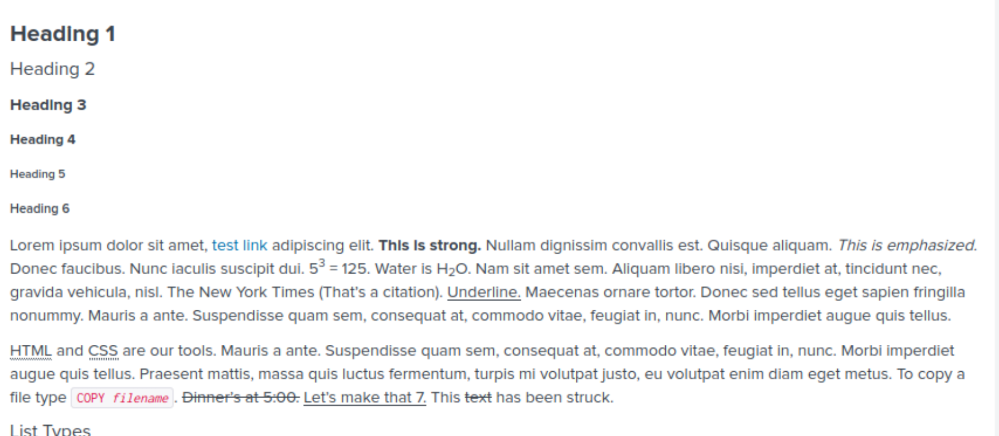

# Splunk Dashboards - What do I need to know?

There are a lot of dashboard panel types in Splunk. This document is for the purpose of giving an overview of some of the most common chart types. All images and descriptions are from the Splunkbase app "Splunk Dashboards Examples" created by Splunk, Inc.

# Splunk Dashboards: Elements

## Chart Element


### Description

The visualizations show two versions of the simple chart panel:

- A columnar chart sourcetypes, stacked, over time for the last 24 hours.
- A columnar chart of the number of events of each sourcetype over the last 24 hours.

The example uses the `_internal` indexed data for convenience. It looks at the sourcetype field to get an idea of what kind of data we have.

Charts can include a *title* parameter, displayed at the top of the panel.

Both examples use the *earliest* timerange parameter to specify data from the last 24 hours.

The **Categorical chart** shows a simple chart visualization. The **Internal sourcetypes ...** chart enhances the data by specifying the additional option parameters, *charting.chart* and *charting.chart.stackMode*, all available using the **Visual Editor**.

From **Edit > Edit Panels**, click the Visualization Editing icons to experiment with different chart visualization formats (line, area, bar, etc.). Click the Edit Properties icons to view options for attributes and axes.

## Table Element


### Description

This `Table Element` example is a simple tabular listing of the number of occurences of the top 100 sourcetypes.

Click **Edit > Edit Panels**. Then click the Table Edit icon. Notice that the **Statistics Table** type of visualization is selected and displayed as a recommended visualization. Column, Bar, and Pie are also recommended visualizations for this data.

For convenience, the example searches for sourcetypes in the `_internal` index, for the last 24 hours:

```
 index=_internal | top limit=100 sourcetype | eval percent = round(percent,2)
```

The search results return the number of sourcetype occurrences and the percentage of total occurrences.

In addition to the `<search>` node the following parameters are also used, which are common to all view groups:

- `<title>`

The option parameters specific to the `Table` view group:

- `wrap`

  Set `wrap` to `true` to wrap the content.

- `rowNumbers`

  Include a line number with each table row. You can see row numbers in the left-most column, if `rowNumbers` is set to `true`.

- `dataOverlayMode`

  Choose a `heatmap`, `highlow`, or no overlay on the displayed results. This example uses no overlay, `none`.

- `drilldown`

  Choose whether or not you can drilldown for more information when you click a particular table cell. You can specify no drilldown functionality, `none`; drilldown by clicking anywhere on the table, `all`; or drilldown by clicking a table, `cell`. This example permits `cell` drilldown, which is not currently implemented.

- `count`

  Specify the number of rows to display per page. This example displays the default, `10`, which is ten rows per page.

Click the Edit icons for the table to modify this example and observe the results of your changes. You can also experiment by clicking the **Edit Source** button to edit the XML code that underlies this simple XML example.

## Single Value Element


### Description

This example demonstrates a single value element with basic drilldown and rangemap configurations.

## Map Element


### Description

This example shows how to plot geographical data on integrated maps.

## HTML Element



### Description

The simple HTML panel provides a way to include text in your dashboard. This can be a useful way to document or clarify dashboard usage. The source is HTML-formatted text.

As the examples show, you can include the HTML in two ways, and both can be used in the same dashboard:

- Write raw HTML text directly in the HTML panel element (right).
- Import the contents of an HTML-formatted file (left).

## Trellis Chart Element


### Description

Trellis layout provides the ability to split a single search result to display a number of similar visualizations.

**Supports most visualizations**

- Apply a Trellis layout to any of the following native  visualizations: Single Value, Column Chart, Bar Chart, Line Chart, Area  Chart, Pie Chart, Choropleth Maps, Scatter Plot, Bubble Chart, Radial  Gauge, Filler Gauge, Marker Gauge
- Trellis layout also works with Custom Visualizations, where  appropriate. Developers can easily declare their visualizations to  support Trellis layouts and enable the feature for their visualization.

**Data-driven number of trellis segments**

- If you are visualizing categories with ever changing values, Trellis layouts know how to handle this! Trellis layouts are data-driven,  meaning that if you have different values for a field tomorrow (e.g. IP  addresses), using Trellis layouts on a dashboard panel will  automatically display appropriate values for a given time range, without having to hard-code them in SPL.

## Bar Chart Element


### Description

The above example shows a simple bar chart.

The data itself highlights the break down of user agents making requests to the splunk instances.

## Bubble Chart


### Description

Visualize three dimensions of your data.

## Table Element with Sparklines


### Description

This example shows how to configure basic and advanced sparkline formatting options.


## Input Elements

- Text Input Form
- Dropdown Form
- Radio Buttons
- Multiselect Input
- Time Picker
- Checkboxes

# Splunk Dashboards: Styling Options

- ## Styling options for Charts

  - **charting.lineWidth**
    - `<option name="charting.lineWidth">2</option>`
  - **charting.legend.mode**
    - `<option name="charting.legend.mode">standard</option>`
  - **charting.fieldDashStyles**
    - `<option name="charting.fieldDashStyles">{"200":"shortDash", "201":"shortDot"}</option>`
  - **charting.axisX.abbreviation**
    - `<option name="charting.axisX.abbreviation">none</option>`
  - **charting.axisY.abbreviation**
    - `<option name="charting.axisY.abbreviation">none</option>`
  - **charting.axisY2.abbreviation**
    - `<option name="charting.axisY2.abbreviation">none</option>`

- ## Color Options

  - `<option name="charting.backgroundColor">#475565</option>`
  - `<option name="charting.foregroundColor">#EBF5FF</option>`
  - `<option name="charting.fontColor">#99CCFF</option>`
  - `<option name="charting.seriesColors">[0xEBF0F5,0xC2D1E0,0x99B2CC,0x7094B8,0x4775A3,0x2E5C8A,0x24476B,0x1A334C,0x0F1F2E,0x050A0F]</option>`

